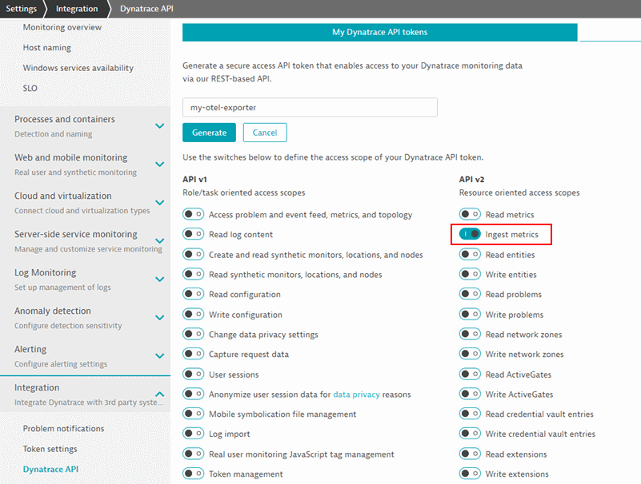

# Dynatrace OpenTelemetry Metrics Exporter for Python

> This project is developed and maintained by Dynatrace R&D.
Currently, this is a prototype and not intended for production use.
It is not covered by Dynatrace support.

This exporter plugs into the OpenTelemetry Metrics SDK for Python, which is in alpha/preview state and neither considered stable nor complete as of this writing.

See [open-telemetry/opentelemetry-python](https://github.com/open-telemetry/opentelemetry-python) for the current state of the OpenTelemetry SDK for Python.

## Getting started

The general setup of OpenTelemetry Python is explained in the official [Getting Started Guide](https://opentelemetry-python.readthedocs.io/en/stable/getting-started.html).

```python
# configure API endpoint and authentication token
exporter = DynatraceMetricsExporter(endpoint_url, api_token)

# setup metrics export pipeline
metrics.set_meter_provider(MeterProvider())
meter = metrics.get_meter(__name__)
metrics.get_meter_provider().start_pipeline(meter, exporter, push_interval_sec)

# crate a counter instrument and provide the first data point
counter = meter.create_counter(
    name="MyCounter",
    description="Description of MyCounter",
    unit="1",
    value_type=int
)

counter.add(25, {"dimension-1", "value-1"})
```

Full setup examples can be found [here](example/).

### Configuration

The exporter allows for configuring the following settings by passing them to the constructor:

#### Dynatrace API Endpoint

The endpoint to which the metrics are sent is specified using the `endpoint_url` parameter.

Given an environment ID `myenv123` on Dynatrace SaaS, the [metrics ingest endpoint](https://www.dynatrace.com/support/help/dynatrace-api/environment-api/metric-v2/post-ingest-metrics/) would be `https://myenv123.live.dynatrace.com/api/v2/metrics/ingest`.

If a OneAgent is installed on the host, it can provide a local endpoint for providing metrics directly without the need for an API token.
This feature is currently in an Early Adopter phase and has to be enabled as described in the [OneAgent metric API documentation](https://www.dynatrace.com/support/help/how-to-use-dynatrace/metrics/metric-ingestion/ingestion-methods/local-api/).
Using the local API endpoint, the host ID and host name context are automatically added to each metric as dimensions.
The default metric API endpoint exposed by the OneAgent is `http://localhost:14499/metrics/ingest`.

#### Dynatrace API Token

The Dynatrace API token to be used by the exporter is specified using the `api_token` parameter and could, for example, be read from an environment variable.

Creating an API token for your Dynatrace environment is described in the [Dynatrace API documentation](https://www.dynatrace.com/support/help/dynatrace-api/basics/dynatrace-api-authentication/).
The scope required for sending metrics is the `Ingest metrics` scope in the **API v2** section:



#### Metric Key Prefix

The `prefix` parameter specifies an optional prefix, which is prepended to each metric key, separated by a dot (`<prefix>.<namespace>.<name>`).

#### Default Labels/Dimensions

The `tags` parameter can be used to optionally specify a list of key/value pairs, which will be added as additional labels/dimensions to all data points.